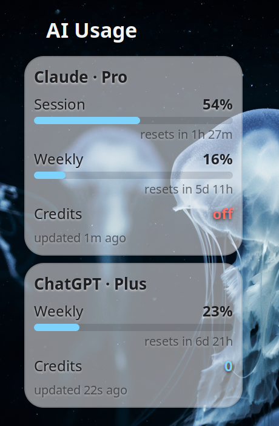

# AI Usage Desklet

A Cinnamon desklet that shows your **Claude** and **ChatGPT** subscription usage at a glance:
usage limits as bars with percentages, live reset countdowns, and any credit balance. It sits
on your desktop, styled to stay readable over any wallpaper or theme, and updates itself.



## What it shows

- **Usage bars** for each limit window (Claude session + weekly, ChatGPT weekly) with a live
  percentage, coloured by severity (blue → amber → red as a limit fills).
- **Reset countdowns** that tick every second and roll over on their own.
- **Credit balance / spend** where the provider reports one.
- A per-card **staleness indicator**: if a reading can't be refreshed, the card dims and shows
  how long ago it was last good, rather than lying or going blank.

## How it works

Two small pieces, so a rendering hiccup can never take down your desktop shell:

1. A short-lived **Python poller** reads the OAuth token files that Claude Code and the Codex
   CLI already keep on disk, calls each service's usage endpoint, normalises both into one
   small JSON file (`~/.cache/ai-usage-desklet/state.json`), and exits. A **systemd user
   timer** runs it on a schedule.
2. The **desklet** reads that JSON file and draws the cards. It makes no network calls and
   writes no files.

Poll rate is per-provider: ChatGPT every 30 s, Claude every 120 s (its usage endpoint rate
limits, so a slower poll keeps it healthy). The countdowns tick locally every second either
way, so the display always looks live. When nothing has used your quota for a while, polling
slows down on its own to save requests.

## Requirements

- **The Cinnamon desktop environment.** This is a Cinnamon desklet; it does not run on GNOME,
  KDE Plasma, XFCE, MATE, or others. See [Compatibility](#compatibility).
- **Python 3.9+** and the **`requests`** library. Nothing else outside the standard library.
- **systemd** for the automatic timer (optional — you can run the poller yourself instead; see
  [Compatibility](#compatibility)).
- **At least one of the two data sources, logged in:**
  - The **Claude** card needs [Claude Code](https://claude.com/claude-code) installed and
    signed in (it creates `~/.claude/.credentials.json`).
  - The **ChatGPT** card needs the **Codex CLI** (or the ChatGPT desktop app's Codex) signed
    in (it creates `~/.codex/auth.json`).
  - If only one is present, that card works and the other shows as unavailable.

The desklet **reads** those token files and never modifies them. See
[Privacy & security](#privacy--security).

## Install

```bash
git clone https://github.com/<your-username>/ai-usage-desklet.git
cd ai-usage-desklet
./install.sh
```

Then add it to your desktop: right-click the desktop → **Add Desklets** → **AI Usage** → Add,
or open **Menu → Desklets**. Drag it where you like.

The installer copies the desklet, the poller, and the systemd units into your home directory,
starts the timer, and does one immediate poll so the cards have data straight away. It does not
touch anything as root.

### Manual install

If you'd rather not run the script:

```bash
# desklet
cp -r desklet/ai-usage@desklet ~/.local/share/cinnamon/desklets/

# poller
mkdir -p ~/.local/share/ai-usage-desklet/providers
cp poller/poller.py poller/normalise.py ~/.local/share/ai-usage-desklet/
cp poller/providers/*.py ~/.local/share/ai-usage-desklet/providers/

# systemd timer
cp systemd/ai-usage-poller.* ~/.config/systemd/user/
systemctl --user daemon-reload
systemctl --user enable --now ai-usage-poller.timer

# seed the first reading
python3 ~/.local/share/ai-usage-desklet/poller.py --once
```

## Settings

Right-click the desklet → **Configure**:

- **Card style** — dark glass (default), light glass, or solid.
- **Density** — compact (default) or standard spacing.
- **Card width**.
- **Show / hide** each provider card, the credits row, and inactive limit bars.
- **Reset-time format** — 24-hour or 12-hour (used in the tooltip).

Hover a card for a tooltip with absolute reset times and full figures. Click a card to open
that provider's usage page in your browser.

## Compatibility

**Desktop environment — Cinnamon only.** Desklets are a Cinnamon feature, so the on-desktop
part runs *only* under Cinnamon. That is distribution-independent: it works on any distro
running Cinnamon, including

- **Linux Mint** (Cinnamon edition)
- **Fedora** (Cinnamon spin) — this is where it was developed and tested
- **Ubuntu / Debian** with the `cinnamon` package
- **Arch / Manjaro / EndeavourOS** with Cinnamon
- **openSUSE** with the Cinnamon pattern

It does **not** work on GNOME, KDE Plasma, XFCE, MATE, Budgie, or any non-Cinnamon desktop —
those have no concept of Cinnamon desklets. Developed on Cinnamon 6.6; it uses only stable
St/CJS APIs and should work on Cinnamon 5.4+.

**Session type.** Developed and tested on **X11**. Cinnamon's Wayland session is still
experimental upstream, but the desklet uses nothing X11-specific and should behave the same
there.

**The poller is portable.** The Python poller and the two systemd units are the only distro-
sensitive parts, and they're undemanding:

- **systemd distros** (Mint, Ubuntu, Debian, Fedora, Arch, Manjaro, openSUSE, …) use the
  included user timer, no extra work.
- **Non-systemd distros** (Void, Artix, Devuan, Gentoo/OpenRC, …) can skip the units entirely.
  The poller has a built-in loop — run `python3 ~/.local/share/ai-usage-desklet/poller.py
  --daemon` from your session autostart, or call `--once` from cron. The desklet only cares
  that `state.json` gets refreshed; it doesn't care what refreshes it.

**Python.** 3.9 or newer (Mint 21, Ubuntu 20.04, Debian 11, and anything more recent all
qualify). The only third-party dependency is `requests`
(`python3-requests` / `pip install requests`).

**Data availability.** The numbers come from Claude Code and the Codex CLI. If you don't use
one of those tools, its card simply shows as unavailable — that's expected, not a bug.

## Privacy & security

- The poller **only reads** `~/.claude/.credentials.json` and `~/.codex/auth.json`. It never
  writes to them and never performs an OAuth refresh — the official tools own those files.
- Your tokens are used solely to authenticate to the two official usage endpoints
  (`api.anthropic.com` and `chatgpt.com`) and are **never written** to any output file, log,
  or error message, and never sent anywhere else. There is no telemetry.
- `state.json` and the cache files are written with `0600` permissions and contain only usage
  percentages, reset times, and plan names — no tokens, emails, or account identifiers.
- The desklet itself makes no network requests and writes no files; it only reads the state
  file and (on click) opens a usage page in your browser.

## A note on the endpoints

Both services' usage endpoints are **undocumented / unofficial**. They work well today but
could change or disappear without notice. The code degrades gracefully when that happens —
a card shows "unavailable" rather than breaking — but if a provider changes its API, that card
may need an update.

## Uninstall

```bash
./uninstall.sh
```

Then remove the desklet from your desktop (right-click it → Remove).

## License

MIT — see [LICENSE](LICENSE).

This is an independent project and is not affiliated with, endorsed by, or supported by
Anthropic or OpenAI. "Claude" and "ChatGPT" are trademarks of their respective owners.
